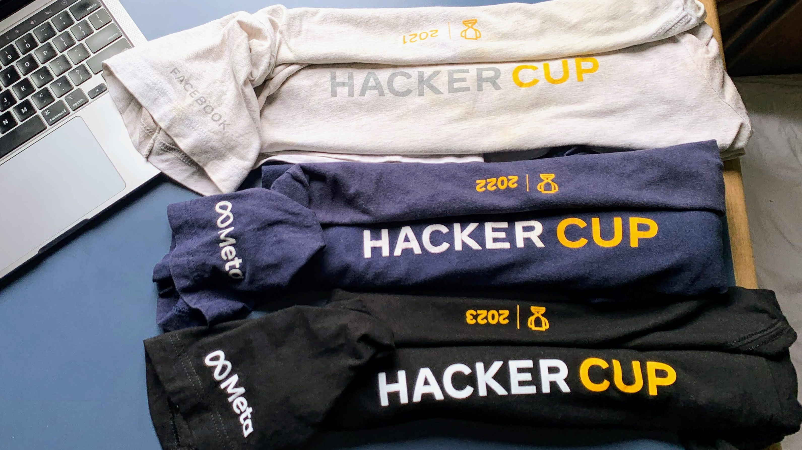

## Achievements
- **[CodeChef](https://www.codechef.com/users/gardusig):** 1st Division.
- **[Codeforces](https://codeforces.com/profile/gardusig):** 1st Division.
- **[ICPC Latin America Finals](https://icpc.global/ICPCID/SP7WIXMME8B8):** Competed in 4 regional finals.
- **[Meta HackerCup](https://www.facebook.com/codingcompetitions/hacker-cup):** Achieved top 2,000 rank for 3 consecutive years, earning a T-shirt as a reward.
    

## Directory Structure

- **`reference/`**: Implementations of various algorithms and data structures.
- **`solutions/`**: Solutions for various competitive programming contests.
- **`template/`**: Code templates and files used for competitive programming contests.

## Compile options

### C++

```shell
g++-14 \
    -std=c++23 \
    -O3 \
    -Wall \
    -Wl,-stack_size -Wl,10000000 \
    main.cpp
```
